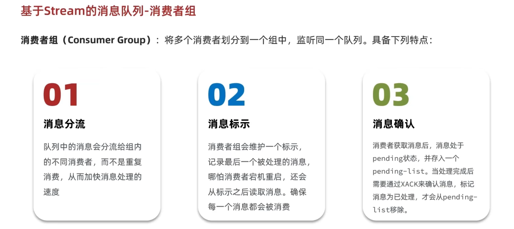

# Redis 基础

## 通用命令

- `KEYS *`：查找所有键,不建议在生产环境设备上使用
- `EXISTS key`：检查键是否存在
- `TYPE key`：返回键的数据类型
- `DEL key`：删除键
- `TTL key`：返回键的过期时间
- `FLUSHDB`：清空当前数据库
- `FLUSHALL`：清空所有数据库
- `HELP`：查看帮助文档

## Base

### Key 命名

- redis的key虽然可以自定义，但最好遵循下面的几个最佳实践约定：
- 遵循基本格式：[业务名称】:[数据名】:[id]。 如：login:user:10
- 长度不超过44字节
- 不包含特殊字符

#### 优点

- 可读性强、避免 key 冲突、方便管理、更节省内存： key是 string

### PipeLine

#### 单个命令的执行流程

- 一次命令的响应时间 = 1次网络往返传输耗时 + 1次 Redis 命令执行时间

``` typescript

await redis.set('key', 'value');
await redis.set('key2', 'value2');
```

- 批量数据操作（原生的M操作）

``` typescript

// 批量设置
await redis.mSet([
  ['key1', 'value1'],
  ['key2', 'value2'],
]);

// 批量获取
const values = await redis.mGet(['key1', 'key2']);

```

##### 注意

- 批处理时不建议一次携带太多命令
- Pipeline 的多个命令之间不具备原子性

## Stream


